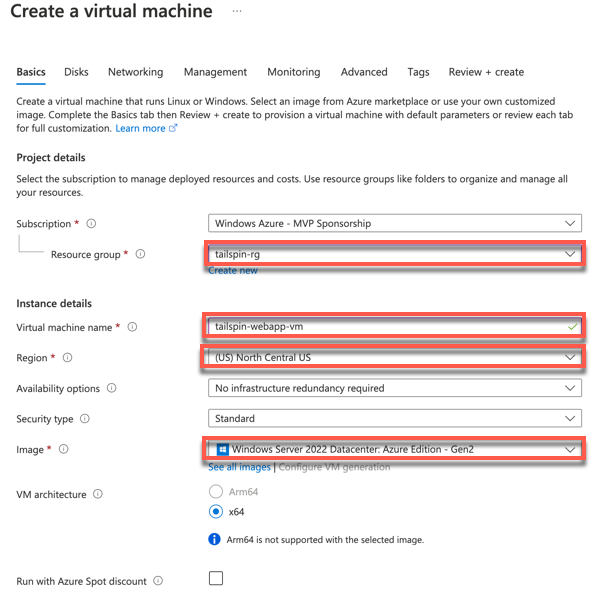
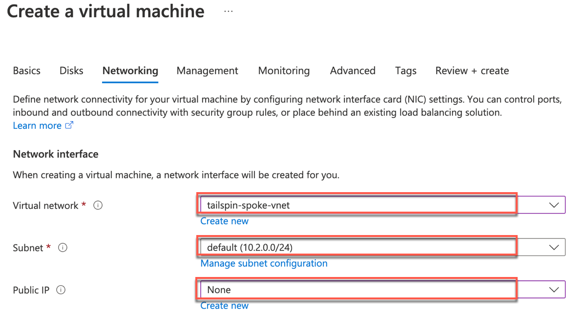
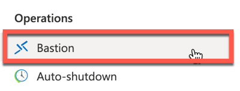
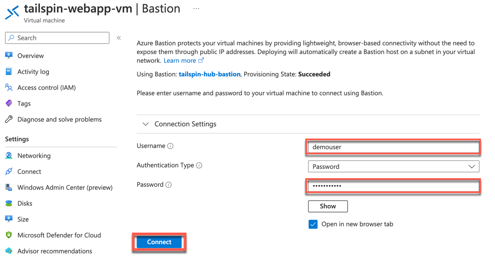
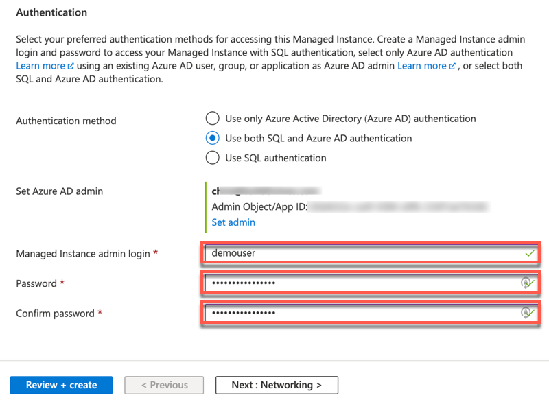

Building the business migration case with Windows Server and SQL Server

Hands-on lab step-by-step

September 2022

Information in this document, including URL and other Internet Web site references, is subject to change without notice. Unless otherwise noted, the example companies, organizations, products, domain names, e-mail addresses, logos, people, places, and events depicted herein are fictitious, and no association with any real company, organization, product, domain name, e-mail address, logo, person, place or event is intended or should be inferred. Complying with all applicable copyright laws is the responsibility of the user. Without limiting the rights under copyright, no part of this document may be reproduced, stored in or introduced into a retrieval system, or transmitted in any form or by any means (electronic, mechanical, photocopying, recording, or otherwise), or for any purpose, without the express written permission of Microsoft Corporation.

Microsoft may have patents, patent applications, trademarks, copyrights, or other intellectual property rights covering subject matter in this document. Except as expressly provided in any written license agreement from Microsoft, the furnishing of this document does not give you any license to these patents, trademarks, copyrights, or other intellectual property.

The names of manufacturers, products, or URLs are provided for informational purposes only and Microsoft makes no representations and warranties, either expressed, implied, or statutory, regarding these manufacturers or the use of the products with any Microsoft technologies. The inclusion of a manufacturer or product does not imply endorsement of Microsoft of the manufacturer or product. Links may be provided to third party sites. Such sites are not under the control of Microsoft and Microsoft is not responsible for the contents of any linked site or any link contained in a linked site, or any changes or updates to such sites. Microsoft is not responsible for webcasting or any other form of transmission received from any linked site. Microsoft is providing these links to you only as a convenience, and the inclusion of any link does not imply endorsement of Microsoft of the site or the products contained therein.

© 2022 Microsoft Corporation. All rights reserved.

Microsoft and the trademarks listed at <https://www.microsoft.com/en-us/legal/intellectualproperty/Trademarks/Usage/General.aspx> are trademarks of the Microsoft group of companies. All other trademarks are property of their respective owners.

**Contents** 

<!-- TOC -->

- [Building the business migration case with Windows Server and SQL Server hands-on lab step-by-step](#building-the-business-migration-case-with-windows-server-and-sql-server-hands-on-lab-step-by-step)
    - [Abstract and learning objectives](#abstract-and-learning-objectives)
    - [Overview](#overview)
    - [Solution architecture](#solution-architecture)
    - [Requirements](#requirements)
    - [Before the hands-on lab](#exercise-1-before-the-hands-on-lab)
    - [Exercise 1: Create VM to Migrate Web Application](#exercise-1-create-vm-to-migrate-web-application)
        - [Task 1: Create Windows Server 2022 VM](#task-1-create-windows-server-2022-vm)
        - [Task 2: Check Remote Desktop Access](#task-2-check-remote-desktop-access)
    - [Exercise 2: SQL Database Migration](#exercise-2-sql-database-migration)
        - [Task 1: Create Subnet for Azure SQL MI](#task-1-create-subnet-for-azure-sql-mi)
        - [Task 2: Create Azure SQL MI](#task-1-create-azure-sql-mi)
        - [Task 3: Migrate On-premises database to SQL MI](#task-2-migrate-on-premises-database-to-sql-mi)
    - [Exercise 3: Azure Arc-enable On-premises VM](#exercise-3-azure-arc-enable-on-premises-vm)
        - [Task 1: Task name](#task-1-task-name-2)
        - [Task 2: Task name](#task-2-task-name-2)
    - [After the hands-on lab](#after-the-hands-on-lab)
        - [Task 1: Task name](#task-1-task-name-3)
        - [Task 2: Task name](#task-2-task-name-3)

<!-- /TOC -->

# Building the business migration case with Windows Server and SQL Server hands-on lab step-by-step

## Abstract and learning objectives

\[Insert what is trying to be solved for by using this workshop. . . \]

## Overview

\[insert your custom workshop content here . . . \]

## Solution architecture

\[Insert your end-solution architecture here. . .\]

## Requirements

1.  Number and insert your custom workshop content here . . . 

## Before the hands-on lab

Refer to the Before the hands-on lab setup guide manual before continuing to the lab exercises.

## Exercise 1: Create VM to Migrate Web Application

Duration: 30 minutes

In this exercise, you will create a new Windows Server 2022 virtual machine (VM) that will be the destination for migrating the on-premises Web Application to Azure, and then you will use Azure Bastion to connect to the VM over Remote Desktop (RDP). Azure Bastion will allow secure remoting to the VM for Administrators.

### Task 1: Create Windows Server 2022 VM

In this task, you will create a new Windows Server 2022 virtual machine (VM) that will be the destination for migrating the on-premises Web Application to Azure.

1. Sign in to the [Azure Portal](https://portal.azure.com). Ensure that you're using a subscription associated with the same resources you created during the Before the hands-on lab setup.

2. On the **Home** page within the Azure Portal, towards the top, select **Create a resource**.

3. Within the **Search services and marketplace** field, type **Windows Server** and press Enter to search the marketplace.

4. Select **Windows Server**.

    

5. Choose **Windows Server 2022 Datacenter**, then select **Create**.

6. On the **Create a virtual machine** pane, set the following values to configure the new virtual machine:

    - **Resource group**: Select the resource group that you created for this lab. Such as `tailspin-rg`.
    - **Virtual machine name**: Give the VM a unique name, such as `tailspin-webapp-vm`
    - **Region**: Select the Azure Region that was used to create the resource group
    - **Image**: Verify the image is set to **Windows Server 2022 Datacenter**

    

7. Set the **Size** field select the **Standard_D4s_v5** virtual machine size.

    

8. Set a **Username** and **Password** for the **Administrator account** for the VM.

    > **Note**: Be sure to save the Username and Password for the VM, so it can be used later. Recommendation for easy to remember Username is `demouser` and Password is `demo!pass123`.

9. Select **Next** until you are navigated to the **Networking** tab of the ** Create a virtual machine page.

    

10. Provision the VM in the Spoke VNet in Azure by selecting the following values under the **Network interface** section:

    - **Virtual network**: Select the Spoke VNet that was created for this lab. It's name will be silimar to `tailspin-spoke-vnet`
    - **Subnet**: `default`
    - **Public IP**: `None`

    

11. Set the following values to ensure that HTTPS traffic will be allowed to connect to the VM:

    - **Public inbound ports**: `Allow selected ports`
    - **Select inbound ports**: `HTTPS (443)`

    

12. Select **Review + create** to review the virtual machine settings.

13. Select **Create** to begin provisioning the virtual machine.

### Task 2: Check Remote Desktop Access

In this task, you will test Remote Desktop (RDP) connectivity to the newly created virtual machine using Azure Bastion.

1. In the Azure Portal, navigate to the newly created **Virtual Machine**.

    

2. On the left, under the **Operations** section, select **Bastion**.

    

3. On the **Bastion** pane, enter the **Username** and **Password** that was set for the Administrator User of the VM when it was created, then select **Connect**

    

    > **Note**: The Azure Bastion instance named `tailspin-hub-bastion` was previously created with the Before the Hands-on lab setup. This is a required resource for using Azure Bastion to securely connect to Azure VMs using RDP from within the Azure Portal.

4. A new browser tab will open with Azure Bastion connected to the virtual machine over RDP. To close this session, you can close this browser tab.

    

> **Note**: Now that the Windows Server 2022 VM has been created in Azure, Tailspin Toys will now be able to modify their Continuous Integration and Continuous Deployment (CD/CD) pipelines within Azure DevOps to begin deploying the Web Application code to this virtual machine as they get ready for migrating the application to Azure.

## Exercise 2: SQL Database Migration

Duration: X minutes

\[insert your custom Hands-on lab content here . . . \]

### Task 1: Create Subnet for Azure SQL MI

1. Within the Azure Portal, navigate to Resource Group created for this lab, and go to the `tailspin-spoke-vnet` virtual network.

2. Under **Settings**, select the **Subnets** link.

    

3. Select **+Subnet** to create a new Subnet.

4. On the **Add subnet** pane, enter the following values to create a Subnet that will used by the Azure SQL Managed Instance that will be created later:

    - **Name**: `AzureSQLMI`
    - **Subnet address range**: `10.2.1.0/24`
    - **Delegate subnet to a service**: `Microsoft.Sql/managedInstances`

    

5. Select **Save**. The list of Subnets will now look like the following:

    

### Task 2: Create Azure SQL MI

1. On the **Home** page within the Azure Portal, towards the top, select **Create a resource**.

2. Within the **Search services and marketplace** field, type **Azure SQL Managed Instance**, press Enter, and select it in the search results.

3. Select **Create**.

4. On the **Create Azure SQL Managed Instance** pane, set the following values:

    - **Resource group**: Select the resource group that you created for this lab. Such as `tailspin-rg`
    - **Managed Instance name**: Enter a unique name, such as `tailspin-sqlmi`
    - **Region**: Select the Azure Region that was used to create the resource group.

5. For **Compute + storage**, select **Configure Managed Instance**.

    

6. For the **Compute + storage** configured select the following values:

    - **Service tier**: General Purpose
    - **Hardware generation**: Standard-series
    - **vCores**: 8 vCores
    - **Storage in GB**: 64 GB

    

7. Select **Apply**

8. Under **Authentication**, set the **Authentication Method** value to **Use both SQL and Azure AD authentication**.

9. Under **Azure AD admin**, select **Set admin** and choose an Azure AD user for the Azure AD admin. You should choose your own User account.

    > **Note**: To choose the Azure AD admin, an organization account must be selected. A personal Microsoft Account cannot be used for this.

10. Enter a username to use for the **Managed Instance admin login** and a **Password** for this new Administrator user that will be created on the database server.

    > **Note**: Using the `demouser` username that was used previously in the lab, will make it easier to remember. However, this does require a password length of 16 characters, so here's an example password that is similar to the previous one used in the lab: `demo!pass1234567`

    

11. Select **Next: Networking >**.

12. On the **Networking** pane, enter the following values:

    - **Virtual network / subnet**: `tailspin-spoke-vnet/AzureSQLMI`

    

13. Select **Review + create**.

14. Select **Create**.

    Deploying the new instance of Azure SQL Managed Instance will take a few minutes to complete.

### Task 2: Migrate On-premises database to SQL MI

1.  Number and insert your custom workshop content here . . . 

    -  Insert content here

        -  

## Exercise 3: Azure Arc-enable On-premises VM

Duration: X minutes

\[insert your custom Hands-on lab content here . . .\]

Creds:
Administrator
demo!pass123

### Task 1: Task name

1.  Number and insert your custom workshop content here . . .

    -  Insert content here

        -  
        
### Task 2: Task name

1.  Number and insert your custom workshop content here . . .

    -  Insert content here

        -  
        
## After the hands-on lab 

Duration: X minutes

\[insert your custom Hands-on lab content here . . .\]

### Task 1: Task name

1.  Number and insert your custom workshop content here . . .

    -  Insert content here

        -  

### Task 2: Task name

1.  Number and insert your custom workshop content here . . .

    -  Insert content here

        -    

You should follow all steps provided *after* attending the Hands-on lab.
