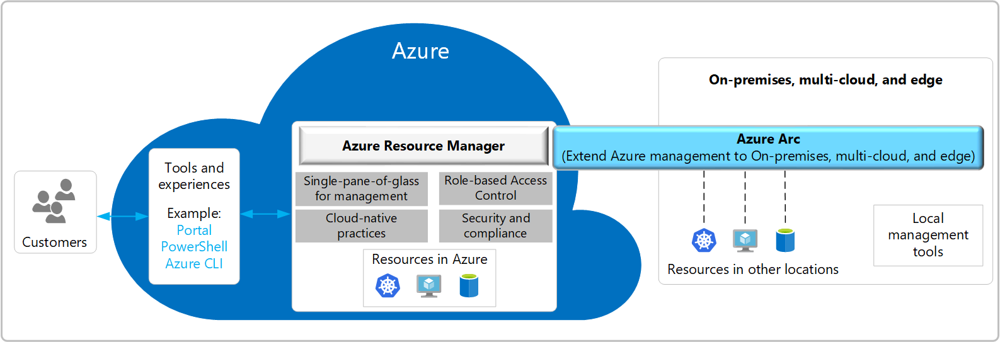

Building the business migration case with Windows Server and SQL Server

Whiteboard design session trainer guide

September 2022

Information in this document, including URL and other Internet Web site references, is subject to change without notice. Unless otherwise noted, the example companies, organizations, products, domain names, e-mail addresses, logos, people, places, and events depicted herein are fictitious, and no association with any real company, organization, product, domain name, e-mail address, logo, person, place or event is intended or should be inferred. Complying with all applicable copyright laws is the responsibility of the user. Without limiting the rights under copyright, no part of this document may be reproduced, stored in or introduced into a retrieval system, or transmitted in any form or by any means (electronic, mechanical, photocopying, recording, or otherwise), or for any purpose, without the express written permission of Microsoft Corporation.

Microsoft may have patents, patent applications, trademarks, copyrights, or other intellectual property rights covering subject matter in this document. Except as expressly provided in any written license agreement from Microsoft, the furnishing of this document does not give you any license to these patents, trademarks, copyrights, or other intellectual property.

The names of manufacturers, products, or URLs are provided for informational purposes only and Microsoft makes no representations and warranties, either expressed, implied, or statutory, regarding these manufacturers or the use of the products with any Microsoft technologies. The inclusion of a manufacturer or product does not imply endorsement of Microsoft of the manufacturer or product. Links may be provided to third party sites. Such sites are not under the control of Microsoft and Microsoft is not responsible for the contents of any linked site or any link contained in a linked site, or any changes or updates to such sites. Microsoft is not responsible for webcasting or any other form of transmission received from any linked site. Microsoft is providing these links to you only as a convenience, and the inclusion of any link does not imply endorsement of Microsoft of the site or the products contained therein.

© 2022 Microsoft Corporation. All rights reserved.

Microsoft and the trademarks listed at https://www.microsoft.com/en-us/legal/intellectualproperty/Trademarks/Usage/General.aspx are trademarks of the Microsoft group of companies. All other trademarks are property of their respective owners.

**Contents**

<!-- TOC -->

- [Trainer information](#trainer-information)
  - [Role of the trainer](#role-of-the-trainer)
  - [Whiteboard design session flow](#whiteboard-design-session-flow)
  - [Before the whiteboard design session: How to prepare](#before-the-whiteboard-design-session-how-to-prepare)
  - [During the whiteboard design session: Tips for an effective whiteboard design session](#during-the-whiteboard-design-session-tips-for-an-effective-whiteboard-design-session)
- [Building a resilient IaaS architecture whiteboard design session student guide](#building-a-resilient-iaas-architecture-whiteboard-design-session-student-guide)
    - [Abstract and learning objectives](#abstract-and-learning-objectives)
    - [Step 1: Review the customer case study](#step-1-review-the-customer-case-study)
        - [Customer situation](#customer-situation)
        - [Customer needs](#customer-needs)
        - [Customer objections](#customer-objections)
        - [Infographic for common scenarios](#infographic-for-common-scenarios)
    - [Step 2: Design a proof of concept solution](#step-2-design-a-proof-of-concept-solution)
    - [Step 3: Present the solution](#step-3-present-the-solution)
    - [Wrap-up](#wrap-up)
    - [Additional references](#additional-references)
- [Building a resilient IaaS architecture whiteboard design session trainer guide](#building-a-resilient-iaas-architecture-whiteboard-design-session-trainer-guide)
    - [Step 1: Review the customer case study](#step-1-review-the-customer-case-study-1)
    - [Step 2: Design a proof of concept solution](#step-2-design-a-proof-of-concept-solution-1)
    - [Step 3: Present the solution](#step-3-present-the-solution-1)
    - [Wrap-up](#wrap-up-1)
    - [Preferred target audience](#preferred-target-audience)
    - [Preferred solution](#preferred-solution)
    - [Checklist of preferred objection handling](#checklist-of-preferred-objection-handling)
    - [Customer quote (to be read back to the attendees at the end)](#customer-quote-to-be-read-back-to-the-attendees-at-the-end)

<!-- /TOC -->

# Trainer information

Thank you for taking time to support the whiteboard design sessions as a trainer!

## Role of the trainer

An amazing trainer:

- Creates a safe environment in which learning can take place.

- Stimulates the participant's thinking.

- Involves the participant in the learning process.

- Manages the learning process (on time, on topic, and adjusting to benefit participants).

- Ensures individual participant accountability.

- Ties it all together for the participant.

- Provides insight and experience to the learning process.

- Effectively leads the whiteboard design session discussion.

- Monitors quality and appropriateness of participant deliverables.

- Effectively leads the feedback process.

## Whiteboard design session flow

Each whiteboard design session uses the following flow:

**Step 1: Review the customer case study (15 minutes)**

Outcome 

Analyze your customer's needs.

- Customer's background, situation, needs and technical requirements

- Current customer infrastructure and architecture

- Potential issues, objectives and blockers

**Step 2: Design a proof of concept solution (60 minutes)**

Outcome

Design a solution and prepare to present the solution to the target customer audience in a 15-minute chalk-talk format.

- Determine your target customer audience.

- Determine customer's business needs to address your solution.

- Design and diagram your solution.

- Prepare to present your solution.

**Step 3: Present the solution (30 minutes)**

Outcome

Present solution to your customer.

- Present solution

- Respond to customer objections

- Receive feedback

**Wrap-up (15 minutes)**

- Review preferred solution

## Before the whiteboard design session: How to prepare

Before conducting your first whiteboard design session:

- Read the Student guide (including the case study) and Trainer guide.

- Become familiar with all key points and activities.

- Plan the point you want to stress, which questions you want to drive, transitions, and be ready to answer questions.

- Prior to the whiteboard design session, discuss the case study to pick up more ideas.

- Make notes for later.

## During the whiteboard design session: Tips for an effective whiteboard design session

**Refer to the Trainer guide** to stay on track and observe the timings.

**Do not expect to memorize every detail** of the whiteboard design session.

When participants are doing activities, you can **look ahead to refresh your memory**.

- **Adjust activity and whiteboard design session pace** as needed to allow time for presenting, feedback, and sharing.

- **Add examples, points, and stories** from your own experience. Think about stories you can share that help you make your points clearly and effectively.

- **Consider creating a "parking lot"** to record issues or questions raised that are outside the scope of the whiteboard design session or can be answered later. Decide how you will address these issues, so you can acknowledge them without being derailed by them.

***Have fun**! Encourage participants to have fun and share!*

**Involve your participants.** Talk and share your knowledge but always involve your participants, even while you are the one speaking.

**Ask questions** and get them to share to fully involve your group in the learning process.

**Ask first**, whenever possible. Before launching into a topic, learn your audience's opinions about it and experiences with it. Asking first enables you to assess their level of knowledge and experience and leaves them more open to what you are presenting.

**Wait for responses**. If you ask a question such as, "What is your experience with (fill in the blank)?" then wait. Do not be afraid of a little silence. If you leap into the silence, your participants will feel you are not serious about involving them and will become passive. Give participants a chance to think, and if no one answers, patiently ask again. You will usually get a response.

# Building a resilient IaaS architecture whiteboard design session student guide

## Abstract and learning objectives

In this whiteboard design session, you will look at how to design for converting/extending an existing IaaS deployment for resiliency. Throughout the whiteboard design session, you will look at the various configuration options and services to help build resilient architectures.

At the end of the workshop, you will be better able to design and use resiliency concepts including high availability with Availability Zones, disaster recovery for virtual machines to another region using Azure Site Recovery, and SQL Server high availability and disaster recovery using Always On Availability Groups. You will also learn how to assess the availability SLA, RPO and RTO of your design, and how to use Azure Backup to protect and secure your SQL data and VMs against corruption and loss.

You will also discuss how to achieve a similar level of resiliency for a PaaS-based implementation the same application, based on Azure App Service and Azure SQL Database. Finally, you will consider the costs associated with both approaches.

## Step 1: Review the customer case study

**Outcome**

Analyze your customer's needs.

Timeframe: 15 minutes

Directions:  With all participants in the session, the facilitator/SME presents an overview of the customer case study along with technical tips.

1. Meet your team members and trainer.

2. Read all directions for steps 1-3 in the student guide.

3. As a team, review the following customer case study.

### Customer situation

Tailspin Toys is a global manufacturer of children’s toys that was founded in 1957 with their global headquarters located in Milwaukee, WI. Their mission critical workloads are currently hosted in an on-premises data center and are beginning a journey to modernize and migrate into the cloud using Microsoft Azure.

The CTO, Kaylee Frye, has already had the Technical Architects at Tailspin Toys assessing their current environment and what it will take to migrate to the cloud. They are looking to optimize their technology investments by reducing technical debt, streamline operations, and simplify their DevOps workflow. According to Kaylee Frye, "Our development teams have already begun adopting DevOps strategies and implemented CI/CD pipelines with Azure DevOps. We really look forward to better streamlining IT operations as we adopt Microsoft Azure for the infrastructure too."

Tailspin has already completed their first round of analysis to identify the apps and workloads to migrate first. These workloads are hosted using SQL Server and Windows Server VMs. They have compiled an initial list of servers they believe can be migrated now, in addition to some they’ll need to retain on-premises for now.

Their on-premises environment consists of over 250 servers and VMs, although, they don't plan to migrate all of them to Azure. The fear of breaking an existing system during their migration is the reason they've identified just a few servers / VMs to begin the migration.

The first workload they want to migrate to Azure consists of:

- Web Application Front-end
  - ASP.NET MVC using .NET Framework 4.7
  - 2x Windows Server 2012 VMs
    - each with 2 CPU cores and 16 GB memory
- REST API Back-end
  - ASP.NET MVC using .NET Framework 4.7
  - 2x Windows Server 2012 VMs
    - each with 4 CPU cores and 32 GB Memory
- Application Databases
  - SQL Server 2012
  - Data replication across 2x Windows Server 2012 VMs
    - each with 8 CPU cores and 64 GB Memory
  - 3x databases with the following storage sizes
    - Database 1: 1.2 TB
    - Database 2: 435 GB
    - Database 3: 50 GB

They have the following workloads that may not be migrated at this time:

- Windows Domain Controllers
- 3x Network File Shares hosted on Windows Server 2012
- 4x Ubuntu 18.04 Linux VMs running nginx hosting multiple small .NET Core web applications

The Virtual Machines hosted in their on-premises data center are hosted using Windows Hyper-V.

In preparations for their cloud adoption journey, Tailspin has already had an Azure ExpressRoute circuit provisioned to connect to their on-premises data center along with a Hub and Spoke Virtual Network topology in Azure. The ExpressRoute circuit is configured with 2 Gbps bandwidth to connect to the Azure Networking that has been set up in the North Central US region. This will provide them with the necessary Azure networking infrastructure to migrate their workloads. Since they are new to Azure, they will need some additional help in the migrations and modernization of their Windows Server and SQL Server workloads.

### Customer needs

1. Migrate existing workloads to Azure as efficiently as possible.

2. Lower the management burden with a consolidated view to manage all VMs and Servers cross Azure and on-premises.

3. Network security is extremely important as we integrate on on-premises network with Microsoft Azure.

### Customer objections

1. What kind of downtime will be incurred when migrating the Windows Server and SQL Server VMs to Azure?

2. Will we be able to rollback to the on-premises VMs if the migration fails?

3. Tailspin has negotiated an Enterprise Agreement (EA) with Microsoft for their Azure consumption. Any cost estimates need to reflect their EA discount.

### Infographic for common scenarios

**Hub-spoke network topology in Azure**

**Azure Arc control plan**

## Step 2: Design a proof of concept solution

**Outcome**

Design a solution and prepare to present the solution to the target customer audience in a 15-minute chalk-talk format.

Timeframe: 60 minutes

**Business needs**

Directions: With your team, answer the following questions and be prepared to present your solution to others:

1. Who will you present this solution to? Who is your target customer audience? Who are the decision makers?

2. What customer business needs do you need to address with your solution?

**Design**

Directions: With your team, respond to the following questions:

1. How will you migrate the on-premises workloads to Azure?

2. How will you migrate the SQL Server workloads to Azure?

3. How will they reduce the burden of managing both on-premises and Azure workloads?

4. How will Azure VMs be secured in their connections to the on-premises network?

**Pricing**

Provide an estimated cost for the workloads being migrated in your solution.

- Be sure to cover all aspects of the design, including the primary site, DR solution, backup solution, and monitoring costs

- What's the best option for hosting the SQL Server workloads?

- Have you included all appropriate cost-saving measures?

**Prepare**

Directions: As a team:

1. Identify any customer needs that are not addressed with the proposed solution.

2. Identify the benefits of your solution.

3. Determine how you will respond to the customer's objections.

Prepare a 15-minute chalk-talk style presentation to the customer.

## Step 3: Present the solution

**Outcome**

Present a solution to the target customer audience in a 15-minute chalk-talk format.

Timeframe: 30 minutes

**Presentation**

Directions:

1. Pair with another team.

2. One group is the Microsoft team and the other is the customer.

3. The Microsoft team presents their proposed solution to the customer.

4. The customer makes one of the objections from the list of objections.

5. The Microsoft team responds to the objection.

6. The customer team gives feedback to the Microsoft team.

7. Switch roles and repeat Steps 2-6.

## Wrap-up

Timeframe: 15 minutes

Directions: Reconvene with the larger group to hear the facilitator/SME share the preferred solution for the case study.

## Additional references

|    |            |
|----------|:-------------:|
| **Description** | **Links** |
| Microsoft Azure Reference Architectures| <https://docs.microsoft.com/azure/guidance/guidance-architecture> |
| Hub-spoke network topology in Azure | <https://docs.microsoft.com/azure/architecture/reference-architectures/hybrid-networking/hub-spoke> |
| Extend an on-premises network using ExpressRoute | <https://docs.microsoft.com/azure/architecture/reference-architectures/hybrid-networking/expressroute> |
| Azure Arc overview | <https://docs.microsoft.com/azure/azure-arc/overview> |
| What is Azure SQL Managed Instance? | https://docs.microsoft.com/en-us/azure/azure-sql/managed-instance/sql-managed-instance-paas-overview |
| Azure Database Migration Service | <https://azure.microsoft.com/products/database-migration/#overview> |

# Building a resilient IaaS architecture whiteboard design session trainer guide

## Step 1: Review the customer case study

- Check in with your participants to introduce yourself as the trainer.

- Ask, "What questions do you have about the customer case study?"

- Briefly review the steps and timeframes of the whiteboard design session.

- Ready, set, go! Let participants begin.

## Step 2: Design a proof of concept solution

- Check in with your teams to ensure that they are transitioning from step to step on time.

- Provide feedback on their responses to the business needs and design.

  - Try asking questions first that will lead the participants to discover the answers on their own.

- Provide feedback for their responses to the customer's objections.

  - Try asking questions first that will lead the participants to discover the answers on their own.

## Step 3: Present the solution

- Determine which groups will be paired together before Step 3 begins.

- For the first round, assign one group as the presenting team and the other as the customer.

- Have the presenting team present their solution to the customer team.

  - Have the customer team provide one objection for the presenting team to respond to.

  - The presentation, objections, and feedback should take no longer than 15 minutes.

  - If needed, the trainer may also provide feedback.

## Wrap-up

- Have participants reconvene with the larger session group to hear the facilitator/SME share the following preferred solution.

## Preferred target audience

- Kaylee Frye, Chief Technology Officer
- Technical Architects

## Preferred solution

1. How will you migrate the on-premises workloads to Azure?

2. How will you migrate the SQL Server workloads to Azure?

3. How will they reduce the burden of managing both on-premises and Azure workloads?

4. How will Azure VMs be secured in their connections to the on-premises network?

**Pricing**

1. Provide an estimated cost for the workloads being migrated in your solution.

    - Be sure to cover all aspects of the design, including the primary site, DR solution, backup solution, and monitoring costs

    - What's the best option for hosting the SQL Server workloads?

    - Have you included all appropriate cost-saving measures?

    **Solution**

    Pricing Azure solutions is a complex task. The example solution below includes many assumptions, for example on virtual machine size. These need to be validated with Tailspin Toys.

    Since Tailspin Toys and their current on-premises data center is in Milwaukee, WI. The nearest Azure Region to use will be North Central US.

    _Web Application Front-end_
    |    |            |            |            |
    |----------|:-------------:|:-------------:|:-------------:|
    | **Component** | **Region** | **Details / Assumptions** | **Est. Monthly Cost (USD)** |
    | Web VMs | North Central US | 2x D4s v5 VMs (4 vCores, 16 GiB RAM) & Windows Server 2022 | $140.00 each |

    _REST API Back-end_
    |    |            |            |            |
    |----------|:---:|:-------------:|:-------------:|
    | **Component** | **Region** | **Details / Assumptions** | **Est. Monthly Cost (USD)** |
    | Web VMs | North Central US | 2x D8s v5 VMs (8 vCores, 32 GiB RAM) & Windows Server 2022 | $280.00 each|

    > **NOTE:** Some discussion with Tailspin Toys may be needed to determine if additional changes to the choice of VM sizes and number of VMs could further lower hosting cost. Load balancing across a larger number of smaller VMs may help lower cost. Also, it's possible Azure App Service (PaaS services) could be an additional options for hosting the Front-end Web application and the Back-end REST API depending on the clients needs.

    _Application Databases_
    |     |            |            |            |
    |----------|:---:|:-------------:|:-------------:|
    | **Component** | **Region** | **Details / Assumptions** | **Est. Monthly Cost (USD)** |
    | Azure SQL Managed Instance | North Central US | 16 vCores Premium-series General Purpose (7 GB RAM/vCore) & 2 TB storage| $1,265.92 |

    > **NOTE:** Azure SQL Managed Instance should be configured with the Azure Hybrid Benefit to save up to 55% with the SQL Server licenses they already own.

    _Total Cost of Migrated Workloads to Azure_

    This is the total estimated monthly cost for all the Windows Server and SQL Server workloads migrated to Azure.
    |           |                         |
    |-----------|:-----------------------:|
    | Component | Est. Monthly Cost (USD) |
    | Front-end Web VMs | 2x $140.00 |
    | Back-end VMs | 2x $280.00 |
    | SQL MI | $1,265.92 |
    | **TOTAL**| **$2,105.92** |

## Checklist of preferred objection handling

1. What kind of downtime will be incurred when migrating the Windows Server and SQL Server VMs to Azure?

   All application tiers and database will be deployed to the Azure VMs in parallel to the on-premises VMs. This will enable minimal downtime when application load is redirected to the new VMs.

   To ensure data consistency during the migration, there will be a short window of downtime required at the database level when the cut over to the new servers is performed. Data migration using DMS supports online migration, allowing the applications to be kept online while data is synchronized.

2. Will we be able to rollback to the on-premises VMs if the migration fails?

   The migration process will be designed to create new application deployments within their CI/CD pipelines to release to the new Windows Server 2022 VMs in Azure in parallel to the existing on-premises VMs. This will allow traffic to be cut over to the new VMs when ready.

   In the event of an unexpected issue during migration, the existing on-premises VMs, application deployments and databases will remain in place as a fall back. If there is an issue detected during the cut over process, the on-premises servers will be able to immediately pick up where they left off.

3. Tailspin has negotiated an Enterprise Agreement (EA) with Microsoft for their Azure consumption. Any cost estimates need to reflect their EA discount.

   We absolutely want to take advantage of these savings for them! The cost estimates from the Azure Pricing Calculator can be tailored to reflect their EA discount.

## Customer quote (to be read back to the attendees at the end)

"?"

---Kaylee Frye, CTO, Tailspin Toys